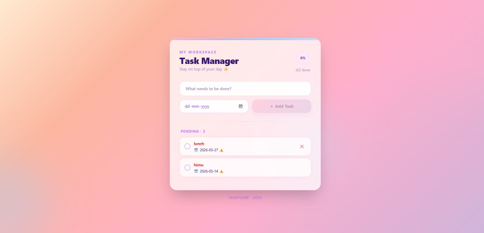

# 📝 TaskFlow – Smart Task Manager App

A modern and responsive **Task Manager Web Application** that helps users efficiently manage daily tasks with features like **add, update, delete, due dates, and progress tracking**.

---

## 🚀 Features

- ➕ Add New Tasks  
- 🗓️ Set Due Date for Tasks  
- ✏️ Update / Edit Tasks  
- ❌ Delete Tasks  
- ✅ Mark Tasks as Completed  
- 📌 Pending & Completed Task Separation  
- 📊 Real-time Progress Indicator (0% → 100%)  
- ⚠️ Deadline Alerts / Indicators  
- 💾 Data stored using Local Storage  
- 📱 Fully Responsive UI  

---

## 🛠️ Tech Stack

- React.js  
- JavaScript  
- HTML5  
- CSS3 / Tailwind CSS  
- Local Storage API
- Node Js
- Express JS
- MySQL 

---

## 📸 Screenshots

### 🏠 Main Dashboard


---

## 🔄 Application Flow

1. User opens the app  
2. Adds a new task with optional due date  
3. Task appears in **Pending Section**  
4. User can:
   - Mark task as completed ✅  
   - Edit task ✏️  
   - Delete task ❌  
5. Completed tasks move to **Completed Section**  
6. Progress bar updates automatically  
7. Data is saved in browser (localStorage)  

---

## ⚙️ Installation & Setup

```bash
git clone https://github.com/your-username/task-manager.git
npm install
npm start
